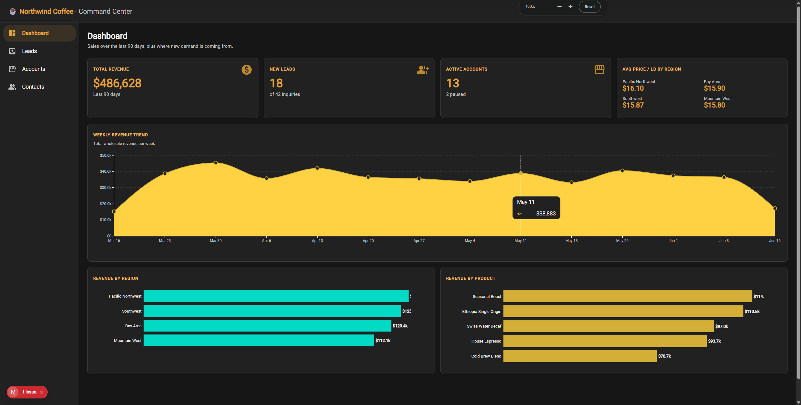
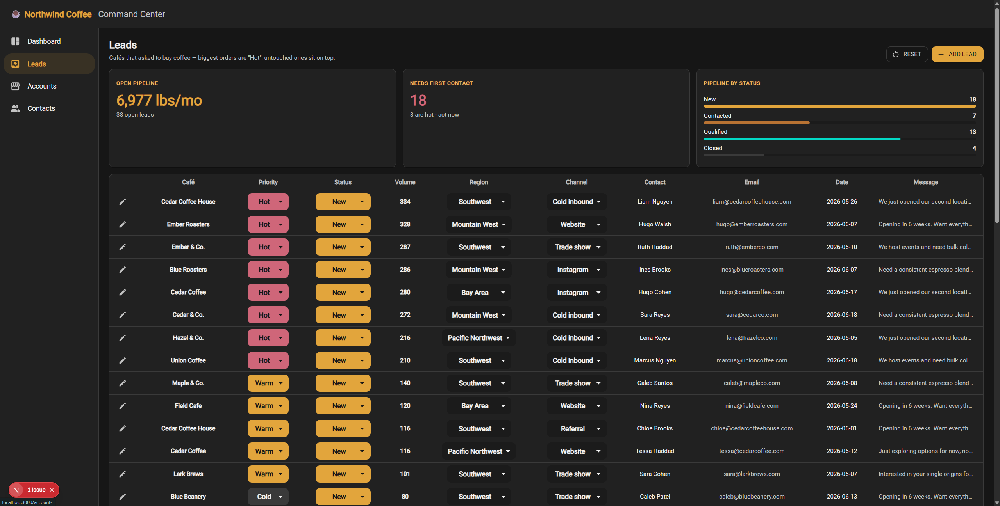
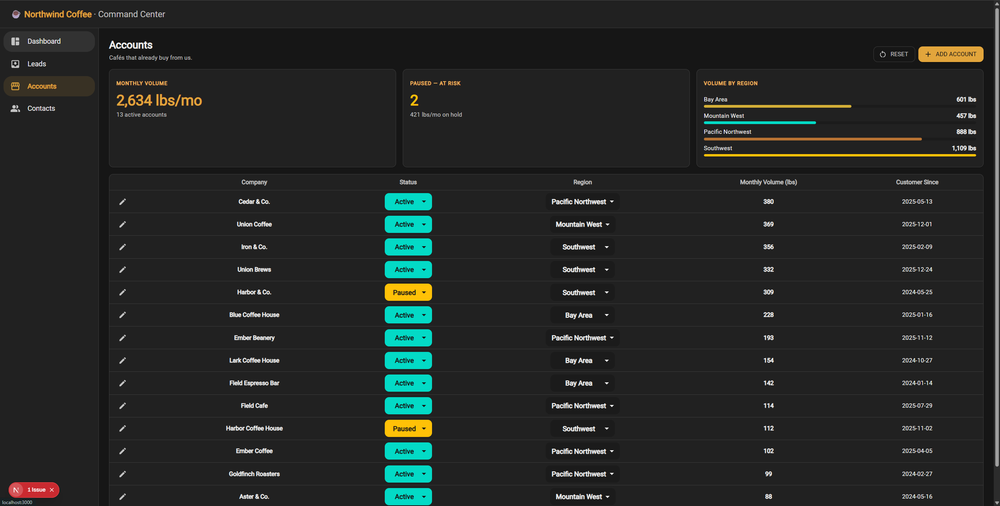
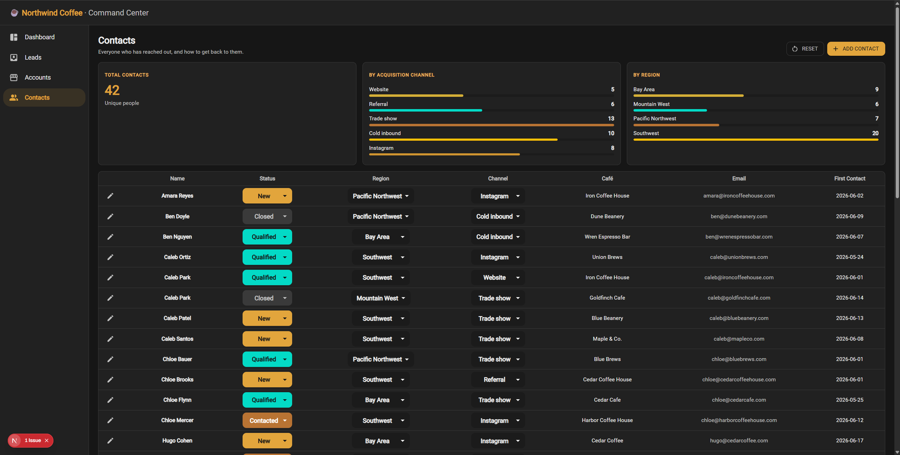

# Northwind Coffee — Command Center

An internal "command center" for **Northwind Coffee**, a wholesale specialty roaster: an at-a-glance sales **Dashboard** and a **Lead Triage** workflow, plus supporting **Accounts** and **Contacts** views — replacing the spreadsheets-and-inboxes way of running the business.

Built for the Northwind OS Challenge. See **[NOTES.md](./NOTES.md)** for the decisions and reasoning behind the build.

**Live demo:** _add your Vercel URL here after the first deploy._

## Quick start

**Prerequisite:** Node.js 18.18+ (20+ recommended).

```bash
npm install   # first time only
npm run dev
```

Then open **http://localhost:3000**.

## Scripts

| Command | What it does |
| --- | --- |
| `npm run dev` | Start the local dev server (http://localhost:3000) |
| `npm run build` | Production build **+ full TypeScript type-check** |
| `npm run start` | Serve the production build locally (run `build` first) |
| `npm run lint` | Run ESLint |

> There is no automated test suite — the challenge didn't require one. `npm run build` is the gate: it type-checks every page and fails the build on any error, so it's the command to run to validate a change.

## Deploy on Vercel

Zero-config — Vercel detects Next.js automatically:

1. Push this repo to GitHub.
2. In [vercel.com/new](https://vercel.com/new), **Import** the repo.
3. Leave the auto-detected **Next.js** preset (build command `next build`; no env vars — the data ships in `data/`).
4. Click **Deploy**. You get a live URL, and every push to `main` redeploys automatically.

Then paste that URL into the **Live demo** line near the top of this README.

## What's inside

- **Dashboard** — headline KPIs (total revenue, new leads, active accounts, avg price/lb by region), a weekly revenue trend, and revenue broken down by region and product.
- **Leads** — inbound inquiries ranked for triage, auto-classified **Hot / Warm / Cold** by requested monthly volume, with an always-editable status (`new → contacted → qualified → closed`) that persists across reloads.
- **Accounts** — current wholesale customers, with throughput and at-risk (paused) volume.
- **Contacts** — directory of everyone who has reached out, by acquisition channel and region.

Editing model: categorical fields (status, priority, region, channel) are **inline always-editable dropdowns**; the per-row pencil opens a side panel to edit text/number/date fields. User edits persist to `localStorage`; the **Reset** button on each page reverts to the source data.

## Screenshots

| Dashboard                                    | Leads (Triage)                       |
| -------------------------------------------- | ------------------------------------ |
|  |  |

| Accounts                                   | Contacts                                   |
| ------------------------------------------ | ------------------------------------------ |
|  |  |

<!-- TODO: add docs/screenshots/{dashboard,leads,accounts,contacts}.png -->

## Data

There is **no backend**. The files in [`data/`](./data) are the read-only "database":

- `sales.json` — daily wholesale sales (last ~90 days)
- `inquiries.json` — inbound wholesale leads
- `accounts.json` — existing wholesale customers

The mock data is treated as read-only source data; user actions (status changes, edits) are persisted separately in `localStorage`.

## Tech stack

- **Next.js** (App Router) + **TypeScript**
- **Material-UI (MUI)** + **MUI X Charts**
- **localStorage** for persisted user state (no database, no auth — per the challenge scope)

## Project roadmap

Planned for future iterations:

- Buttons to add new leads, accounts, and contacts
- Filters on the dashboard, leads, accounts, and contacts
- Global search bar
- Reporting
- Export to CSV
- Admin console to manage users
- Settings module
- Move from browser storage to a real backend and database, with login, user roles, and an audit trail

## Project layout

```
data/                 read-only mock data (sales, inquiries, accounts)
src/app/
  page.tsx            Dashboard
  triage/page.tsx     Leads
  accounts/page.tsx   Accounts
  contacts/page.tsx   Contacts
  ui.tsx              shared cards / formatting helpers
  RecordDrawer.tsx    reusable edit panel
  useEditable.ts      localStorage-backed record store
  palette.ts, theme.ts, AppShell.tsx
docs/screenshots/     screenshots for this README
```
